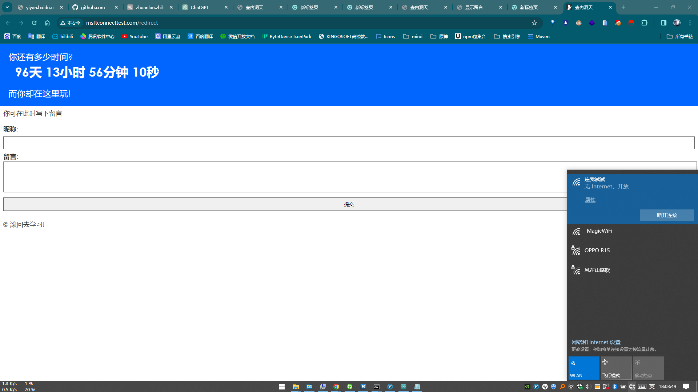
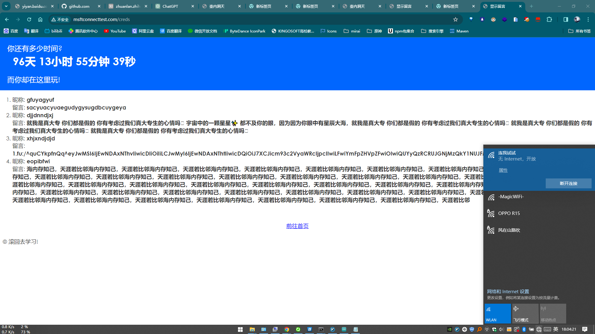
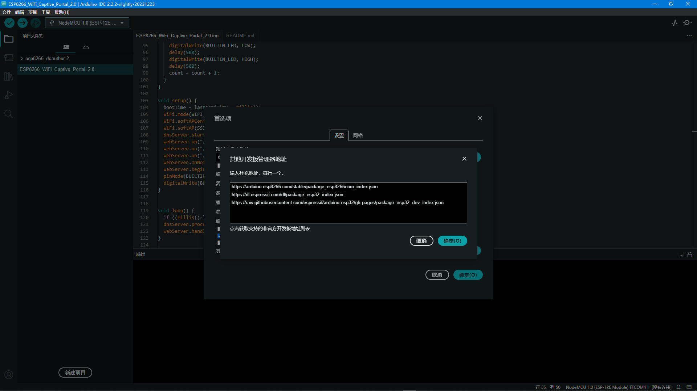

# ESP8266_messageboard
esp8266 留言板 

# 效果图
  


# 快速开始
使用[nodemcu-flasher](./nodemcu-flasher/)工具把[build](./build/)目录下的bin文件写到esp8266即可  

# 从源码开始
1. 下载[arduino-ide](https://www.arduino.cc/en/software)  
2. 导入`ESP8266_messageboard.ino`源码  
3. 选择开发板  
    
    ```
    https://arduino.esp8266.com/stable/package_esp8266com_index.json
    https://dl.espressif.com/dl/package_esp32_index.json
    https://raw.githubusercontent.com/espressif/arduino-esp32/gh-pages/ package_esp32_dev_index.json
    ```
4. 编译，上传